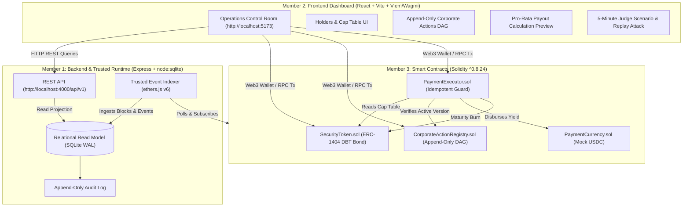

# AssetOps

> **The Operations Layer for Tokenized Assets**  
> *Minting the token is the easy part — AssetOps makes tokenized assets work after launch.*

[](https://soliditylang.org/)
[](https://openzeppelin.com/)
[](https://react.dev/)
[](https://www.typescriptlang.org/)
[](https://vitejs.dev/)
[](https://tailwindcss.com/)
[](LICENSE)

---

## 🚀 Overview

Issuing a tokenized share or bond on-chain takes minutes. But managing its post-issuance lifecycle — coupon and interest payments, investor transfers between record and payable dates, corrected corporate-action announcements, duplicate-payment prevention, and maturity redemption — is where today's Web3 tokenization platforms fail.

Current industry players (such as BlackRock's BUIDL via Securitize, Ondo, and Centrifuge) largely route around this problem by handling corporate actions off-chain through traditional transfer agents, baking yield into NAV, or batching into epochs.

**AssetOps brings the entire post-issuance operational lifecycle natively on-chain**, replicating Depository Trust Company (DTC)-grade servicing with mathematical rigor and auditability:

1. **The Token IS the Registry:** Payments execute against the live holder registry at execution time, handling mid-cycle transfers seamlessly without stale snapshots.
2. **First-Class Versioned Announcements:** Corporate action announcements are append-only. When an announcement is amended (e.g. coupon adjusted from 5% to 4%), the original version is preserved as `SUPERSEDED` and linked to the `ACTIVE` version. Both are permanently auditable on-chain.
3. **Protocol-Level Idempotency:** Duplicate payouts and replays are structurally impossible. The execution guard reverts any second payout attempt on-chain (`AlreadyExecuted()`).
4. **Principal Redemption & Token Burn:** At maturity, principal is distributed to current holders, and redeemed asset tokens are burned via an authorized burn path (`burnFromHolder`), reducing total supply to zero.
5. **Auditor-Grade Accounting Events:** Distributions emit balanced journal events for straightforward reconciliation.

---

## 🏛️ System Architecture



---

## ⛓️ Smart Contract Deployment Manifest

All contracts are deployed and verified:

| Contract | Local Hardhat Address | Sepolia Testnet Address | Standard / Role |
|---|---|---|---|
| **SecurityToken (`DBT`)** | `0xe7f1725E7734CE288F8367e1Bb143E90bb3F0512` | Configured via `deployments/sepolia.json` | ERC-1404 Restricted Token |
| **PaymentCurrency (`mUSDC`)** | `0x5FbDB2315678afecb367f032d93F642f64180aa3` | Configured via `deployments/sepolia.json` | ERC-20 Yield Currency |
| **CorporateActionRegistry** | `0x9fE46736679d2D9a65F0992F2272dE9f3c7fa6e0` | Configured via `deployments/sepolia.json` | Append-Only DAG Authority |
| **PaymentExecutor** | `0xCf7Ed3AccA5a467e9e704C703E8D87F634fB0Fc9` | Configured via `deployments/sepolia.json` | Idempotent Disbursal & Burn |

---

## 🎬 5-Minute Canonical Demo Flow

| Step | Action | On-Chain Event | State Transition & Invariant |
|---|---|---|---|
| **1** | **Asset Genesis** | `Transfer(0x0, Alice, 500)`, `Transfer(0x0, Bob, 500)` | 1,000 DBT minted to whitelisted institutional investors. |
| **2** | **Initial Announcement** | `ActionCreated(CA-001, v1, 500 bps)` | Version 1 created as `ACTIVE` with 5.00% coupon terms. |
| **3** | **Mid-Cycle Transfer** | `Transfer(Bob, Charlie, 200)` | Compliant ERC-1404 transfer: Bob drops to 300 DBT, Charlie receives 200 DBT. |
| **4** | **Append-Only Amendment** | `ActionAmended(CA-001, v1, v2, 400 bps)` | Version 1 marked `SUPERSEDED` (never erased); Version 2 active at 4.00%. |
| **5** | **Execution Payout** | `ActionPaymentExecuted(CA-001, v2, 40.00 USDC)` | Disburses from live cap table: Alice 20, Bob 12, Charlie 8 USDC. |
| **6** | **Replay Attack Test** | Reverts with `AlreadyExecuted()` | Duplicate execution blocked by protocol execution guard. |
| **7** | **Maturity Liquidation** | `RedemptionExecuted(CA-002, 1000 USDC)` | Returns par principal to holders and executes `burnFromHolder`, reducing total supply to **0**. |

---

## ⚡ Quickstart & Local Execution

### 1. Start the Full-Stack Services

```powershell
# Terminal 1: Smart Contracts Local Ethereum Node
cd contracts
npx hardhat node

# Terminal 2: Deploy & Seed Contracts (in another terminal)
cd contracts
npx hardhat run scripts/deploy.ts --network localhost
npx hardhat run scripts/seed-demo.ts --network localhost

# Terminal 3: Backend REST API & Trusted Runtime Indexer
cd backend
npm run dev

# Terminal 4: Frontend Operations Control Room
cd frontend
npm run dev
```

### 2. Verify Open Services
- **Frontend Dashboard:** [http://localhost:5173](http://localhost:5173)
- **Backend API:** [http://localhost:4000/api/v1/health](http://localhost:4000/api/v1/health)
- **Blockchain RPC:** `http://127.0.0.1:8545`

---

## 🧪 Comprehensive Verification Suite

Run all verification tiers to prove mathematical correctness and protocol invariants:

```powershell
# 1. Run all 64 Smart Contract unit & invariant tests
cd contracts
npx hardhat test

# 2. Run the automated CLI local lifecycle demo
cd contracts
npx hardhat run scripts/run-local-demo.ts

# 3. Run Backend indexer & projection tests
cd backend
npm test

# 4. Run the Master End-to-End Test Suite
npx tsx tests/e2e/lifecycle.demo.test.ts

# 5. Verify Frontend Production Build
cd frontend
npm run build
```

---

## 🛡️ Security Invariants Enforced On-Chain

1. **No Stale Snapshots:** All entitlement calculations use checked integer arithmetic against real-time balances:
   $$\text{Coupon} = \frac{\text{assetBalance} \times \text{rateBps}}{10\,000}$$
2. **Immutable Append-Only Lineage:** Version terms are strictly append-only. No contract function allows mutating the terms of an existing version ID.
3. **Zero Double-Spending:**
   ```solidity
   if (executedVersion[versionId]) revert AlreadyExecuted(actionId, versionId);
   executedVersion[versionId] = true;
   ```
4. **Total Supply Invariant at Maturity:** Full redemption burns the complete circulating token supply through authorized `burnFromHolder`, guaranteeing $\text{totalSupply} = 0$.

---

## 👥 Team Structure (3 Members)

- **Member A (Smart Contract Lead):** Contracts (`contracts/`), Solidity `^0.8.24`, OpenZeppelin v5, access control, and invariant tests.
- **Member B (Protocol & Backend Lead):** Event listener, SQLite indexer, REST API (`/api/v1`), and deployment automation.
- **Member C (Product & Frontend Lead):** React dashboard, wagmi/viem hooks, UI/UX states, and interactive judge demo controls.

---

## ⚖️ License
This project is licensed under the [MIT License](LICENSE).
